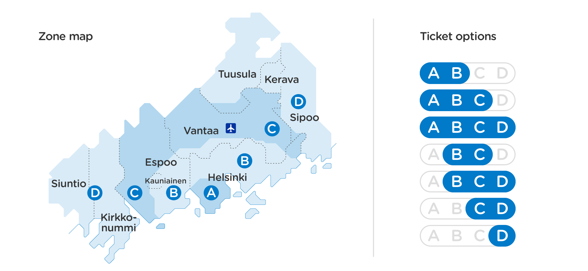

# HSL Zone

A progressive web application to detect your HSL zone based on your location. It
can also monitor your live location and let you know about the zone changes.

## What is this?

The HSL service in Finland, has introduced a new way to separate different types
of transportation tickets based on zones. Of course the official HSL mobile app
has a thorough journey planner and will tell you what type of ticket is required
for a given route. But, this PWA is just a very fast way to check in which zone
you're currently in based on your current geolocation. It's also possible to
live monitor your geolocation changes and zone detection (obviously needs your
permission and is an on demand action).

The information is based on the [HSL open data](https://www.hsl.fi/en/opendata).

## Try it

Head to [hslzone.netlify.com](https://hslzone.netlify.com)

## Development

Install dependencies: `yarn`

Start dev server: `yarn start`

Run tests for zones and geolocation `yarn test`

Build for production `yarn build`

## Deployments

Automatic deployments on master branch by Netlify integration.

## Credits, Thanks, Inspirations

- This project is sponsored by [Futurice's](https://futurice.com/) [Spice Program](http://spiceprogram.org/oss-sponsorship)
- [Create react App](https://facebook.github.io/create-react-app/)
- [Netlify](https://netlify.com)
- Readme style is inspired by [Onkometrorikki.fi](https://Onkometrorikki.fi) project by [@0lpeh](https://twitter.com/0lpeh)

## Supporters

This project is sponsored by [Futurice's](https://futurice.com/) [Open Source Sponsorship program](http://spiceprogram.org/oss-sponsorship)

